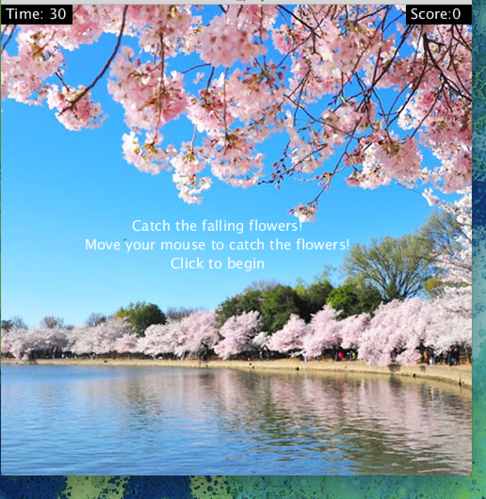
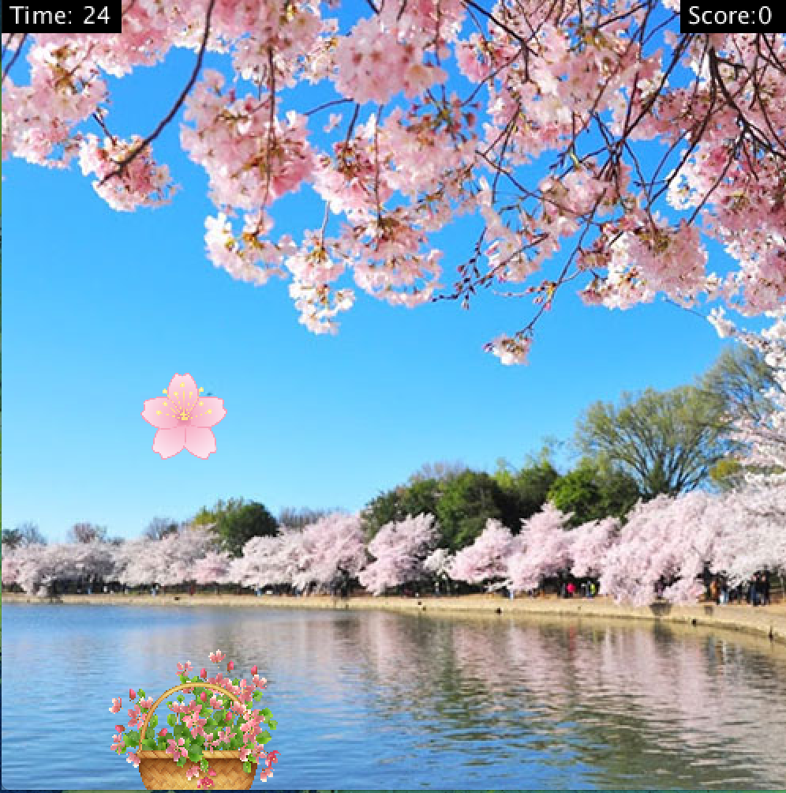
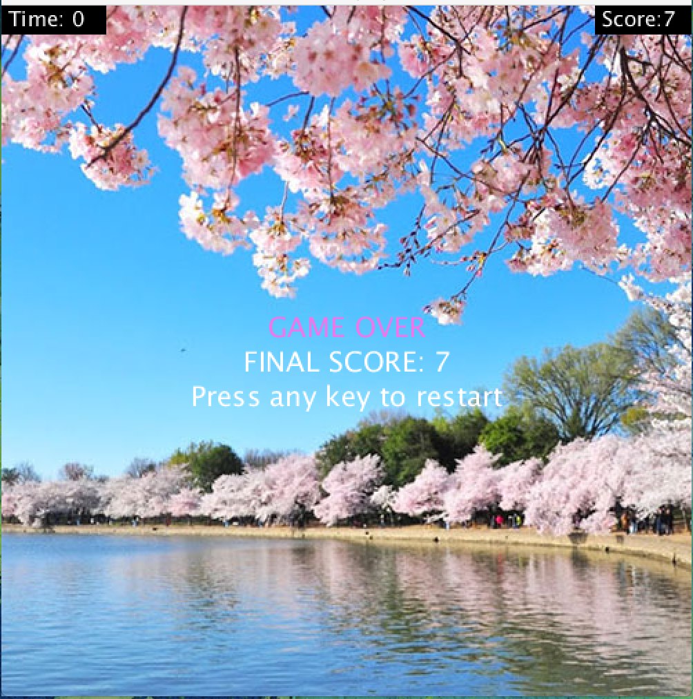

This game was inspired by my mother's love for Japanese flower arranging (Ikebana). I set out to create a simple catch-the-falling-object game and incorporate elements of natural movement to add challenge. The game consists of flowers falling down the screen and a mouse controlled basket at the bottom of the screen. The objective is to catch as many flowers as possible during the 30 second time period, if the player collects 10 flowers they win. After the time is up, players have the choice to restart the game and the clock and score return to their original state.

The updates to the game in this iteration include start and end screens, and sound effects throughout the game. To enhance the relaxing gameplay, there is calm background music which plays continuously through each round of the game. When flowers are caught, a soft dinging sound effect is played, and when a flower is not caught, there is a soft thudding sound. Previously there was an issue with the flowers drifting outside the area of the screen, it was resolved by setting constraints on the object to ensure its path would always be visible.

The largest issue I had during the modification process was in making the game video interactive. My computer’s operating system was incompatible with the original Processing files however I was able to resolve some of the issues with forum based solutions. Ultimately, the user experience with the motion based controls was cumbersome and inconsistent so I reverted to the original mouse controls and it worked much more smoothly. I also had challenges making the game replayable and implemented a gameplay state tracker to switch between the modes.

