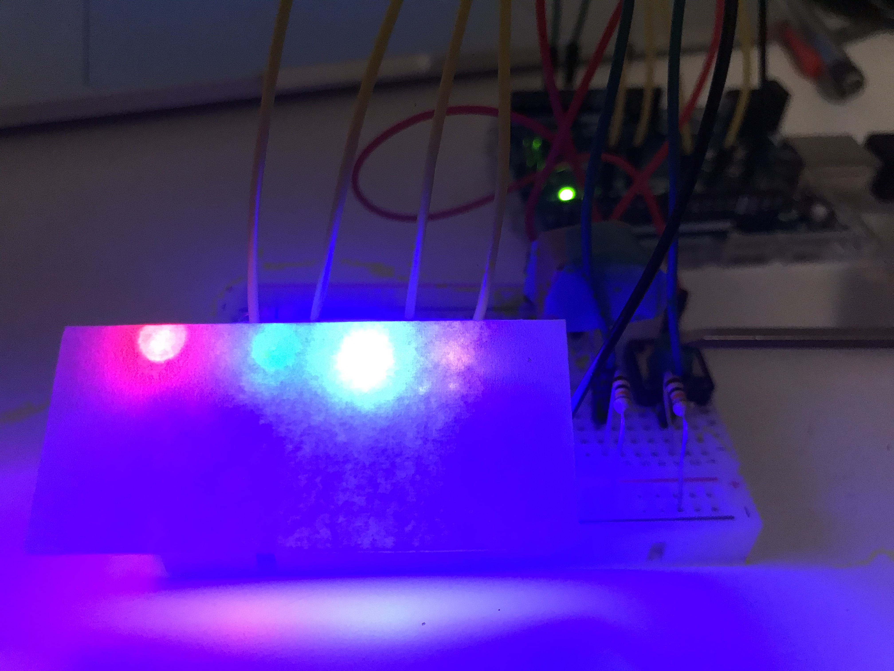
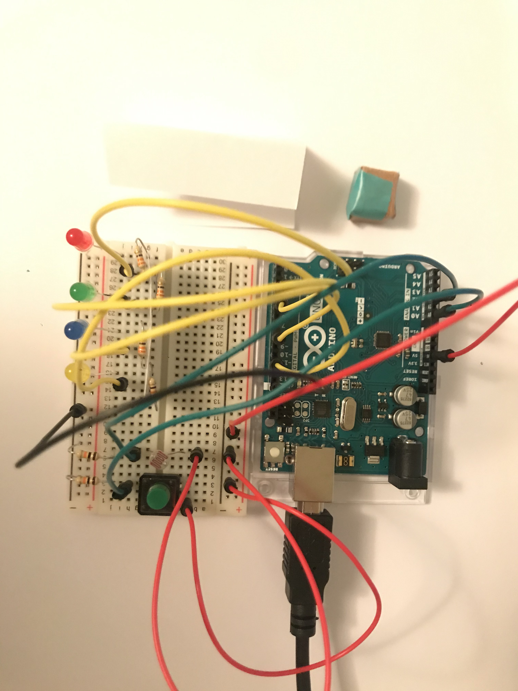
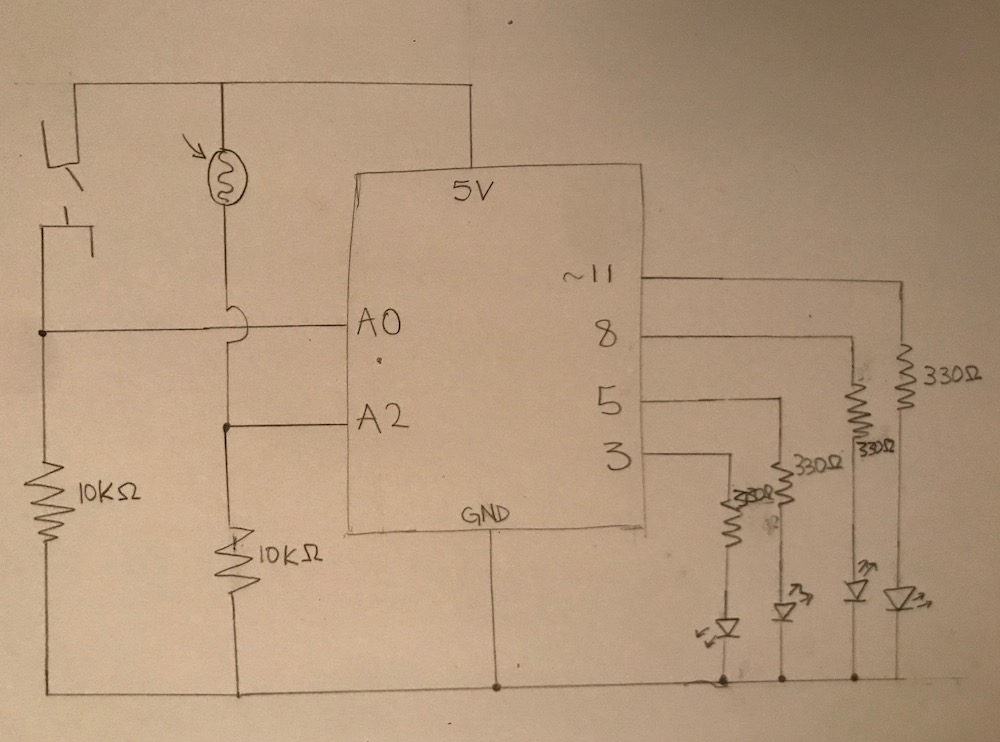

My inspiration for this project was the many examples provided by Arduino as well as the modifications completed in lecture. Using the lecture notes as my primary wiring guide and the Arduino example code, I combined the basic rules of wiring to control four LED lights. With the initial struggles of familiarizing myself with the demands of the task, once I replicated the set up the process became easier.

The four LEDs are controlled by two systems. The first three lights (red, green, blue) are controlled by the digital input/output system. When the switch is pressed and the circuit closes, a random number is generated and the associated case from the switch statement lights the appropriate light. Due to the delays and breaks, none, some, or all the lights may be light at any given time but by default these lights are off. The second system is the analog input/output system which uses a photoresistor to take in ambient light readings and light a yellow LED accordingly- more light brightens the LED and less light dims it.

Through this process I had many difficulties with the physical setup. First, organizing and implementing increasing numbers of LEDs was initially challenging but through playing with the systems and better understanding how to read the schematics and diagrams I better understood not only how but why these linkages were organized. By far the largest issue I had with this project was the organization of the breadboard. As I decided to use four lights and two sensors, this entailed six resistors and ten wires all connected at 38 points on the breadboard. After ensuring the program ran as desired, I went back through the breadboard and clustered like functions while ensuring accessibility to the sensors for manipulation. 

Finally, outside the technical aspects of the project, I added a white paper light filter to diffuse some of the harsh light of the LEDs (pictured bottom left) and constructed a small cap to fit over the photoresistor to ensure the lighting change was sufficiently noticeable (top left). 

