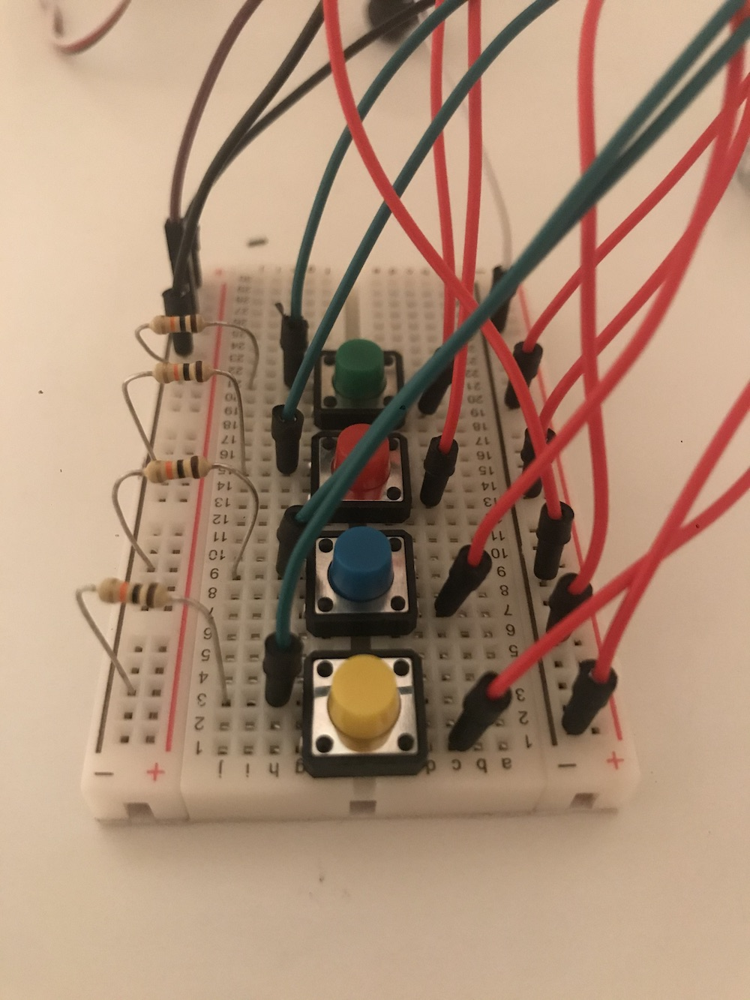
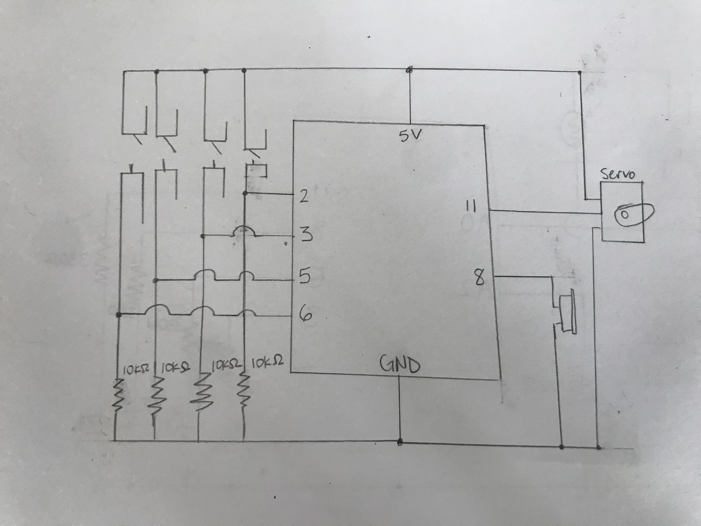

My inspiration for this project is the repetitive melody of Johann Strauss II’s most famous work The Blue Danube Waltz. When simplified, this piece has four simple melodic elements which correspond to the four push buttons in the class kit. I used the servo as a metronome by adding a bamboo skewer to tap on a plastic toy to help the player time their cues. 

While building the mechanical aspects of the instrument, I had trouble with overcrowding of the breadboard and wire organization. In order to simplify as much as possible, I kept the buzzer and servo elements off the board by using some wires I had on hand. 

Going forward I would refine the control systems as the switches I have employed are unreliable (requires multiple presses/ changed angles) to play. Additionally, I would add a knob to adjust the volume of the speaker and find better sonic implements for the servo metronome.

Video:

https://youtu.be/wl6eXLMhc-g

Sheet Music:

https://makingmusicfun.net/htm/f_printit_free_printable_sheet_music/blue-danube-piano.php
