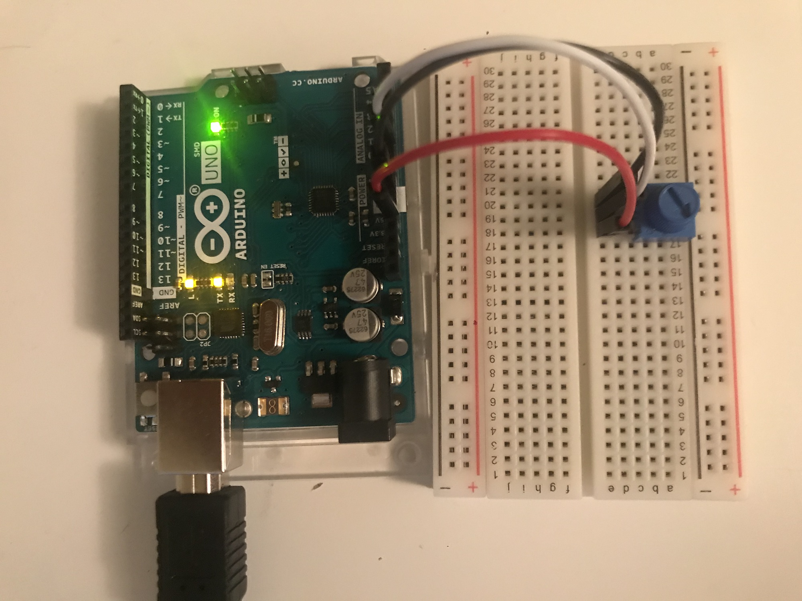
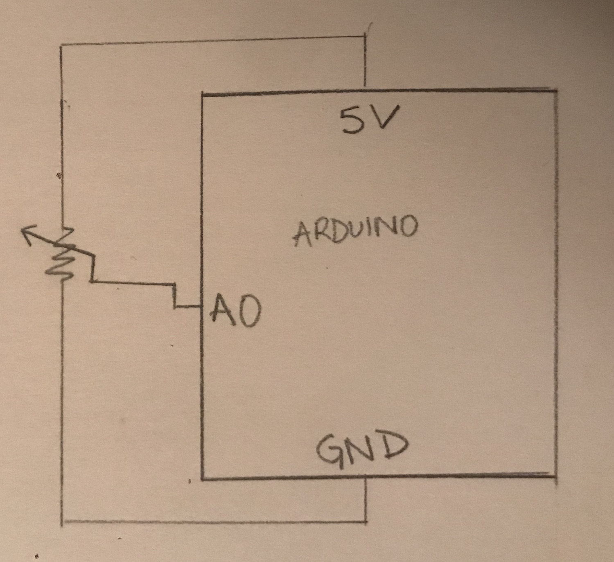

This project introduced an exciting new element of tactile engagement with my game. In my game I have three instances of user controls- starting the game, moving the controller, and restarting the game- I felt that the change of game controls would be the greatest enhancement to gameplay. Ultimately, the knob controller felt like the most intuitive controller as the direction of motion in the knob matches the motion of the basket in the game.

Using the Arduino Graph example as a reference, I connected the knob to the Arduino analog input and mapped the values of the knob to the width of the game screen. The wiring and setup were straightforward though I had to be careful to install the knob in an orientation where clockwise rotation meant the values increased. 

The main limitation of this new control system is reduced reliability. The knob connection to the breadboard is not very stable so when turning it quickly or if jostled, the in-game icon glitches. Given the limitations of the materials this issue is not immediately solvable, however with the use of a prototyping shield I could build more robust connections. 

Arduino tutorial: https://www.arduino.cc/en/tutorial/graph
