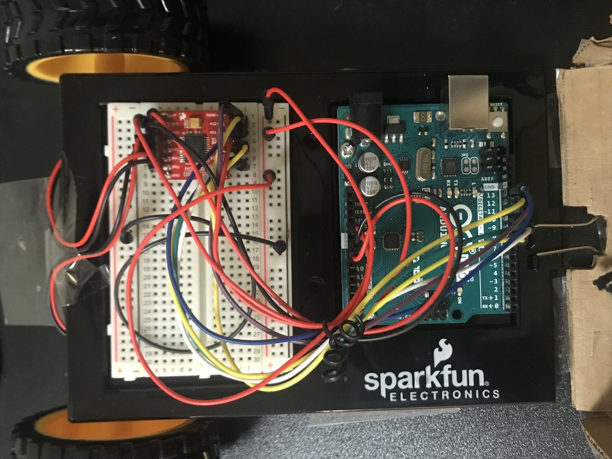

##The Doodle Bot

Final Project

Translating a digital canvas to physical interpretation, this art robot combines Processing input and Arduino outputs to create a collaboration between user and robot. With a mouse controlled canvas, the robot moves by interpreting and responding to onscreen motion and applying its own signature as defined by the rules of the program. The robot can accomodate a variety of drawing and painting tools and bridges the realms of digital and physical art. 

 

The robot itself is driven by two DC motors connected to Arduino and uses the drawing tool and a metal attachment as a caster. Drawing tools are secured by an adjustable elastic strap and connected at two points to the robot to ensure smooth and secure drawing. The electronics are contianed in the cardboard housing, designed to be adjustable and detachable for easy access to the components.

The position change elements track and calculate the relative mouse position from previous frames and determine the movement of the robot. When determining these rules, the basic elements of arc and line drawing were emphasized rather than a an exact positional parallel to make the end result slightly abstract from the user inputs.

Video

https://youtu.be/AufP_CNzHyM

The greatest challenge in making this robot was in creating communicative and responsive programs. Using the tools and resources below I was able to connect the Processing inputs and Arduino outputs in an instantly responsive programs and build the robot itself.

Sparkfun Tutorials

https://learn.sparkfun.com/tutorials/connecting-arduino-to-processing/all

https://learn.sparkfun.com/tutorials/sparkfun-inventors-kit-experiment-guide---v40/circuit-5b-remote-controlled-robot

Arduino Open Source Guide

https://create.arduino.cc/projecthub/ahmedibrrahim/how-to-control-2wd-robot-wirelessly-through-processing-0303f0
